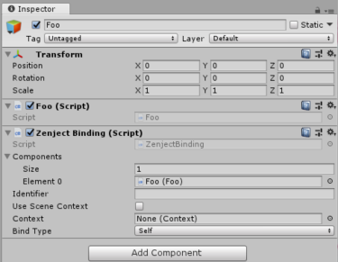

# 场景绑定(Scene Bindings)

在许多情况下，你有很多MonoBehaviours已经被添加到Unity编辑器中的场景中（即在编辑器时而不是运行时），并且你想要将这些MonoBehaviours添加到Zenject容器中，以便它们可以被注入其他类中。

这样做的通常方法是在安装程序中添加对这些对象的公共引用，如下所示：

```
public class Foo : MonoBehaviour
{
}

public class GameInstaller : MonoInstaller
{
    public Foo foo;

    public override void InstallBindings()
    {
        Container.BindInstance(foo);
        Container.Bind<IInitializable>().To<GameRunner>().AsSingle();
    }
}

public class GameRunner : IInitializable
{
    readonly Foo _foo;

    public GameRunner(Foo foo)
    {
        _foo = foo;
    }

    public void Initialize()
    {
        ...
    }
}
```

这工作正常，但在某些情况下，这可能会很麻烦。 例如，如果要允许艺术家向场景添加任意数量的`Enemy`对象，并且还希望将所有这些`Enemy`对象添加到Zenject容器中。 在这种情况下，您必须手动将每个`Enemy`拖动到其中一个安装程序的inspector。 这很容易出错，因为它很容易忘记，或删除`Enemy`的游戏对象，但忘记在inspector中删除安装程序的空引用等。

另一种方法是使用FromComponentInHierarchy绑定方法，如下所示：

```
public class GameInstaller : MonoInstaller
{
    public override void InstallBindings()
    {
        Container.Bind<Foo>().FromComponentInHierarchy().AsTransient();
        Container.Bind<IInitializable>().To<GameRunner>().AsSingle();
    }
}
```

现在，每当需要类型为Foo的依赖项时，zenject将在整个场景中搜索任何类型为Foo的MonoBehaviours。 每次要查找某个依赖项时，这将与使用Unity的[FindObjectsOfType](https://docs.unity3d.com/ScriptReference/Object.FindObjectsOfType.html)方法非常相似。 请注意，因为此方法可能是一个非常繁重的操作，您可能希望将其标记为AsCached或AsSingle：

```
public class GameInstaller : MonoInstaller
{
    public override void InstallBindings()
    {
        Container.Bind<Foo>().FromComponentInHierarchy().AsCached();
        Container.Bind<IInitializable>().To<GameRunner>().AsSingle();
    }
}
```

这样，只有在第一次需要时才会产生搜索性能，而不是每次将其注入任何类时。 还要注意，在我们期望有多个Foos的情况下，我们可以使用`FromComponentsInHierarchy`（注意复数）

另一种方法是使用`ZenjectBinding`组件。 您可以通过将`ZenjectBinding` MonoBehaviour添加到您希望自动添加到Zenject容器的同一游戏对象来完成此操作。

例如，如果你的场景中有一个类型为`Foo`的MonoBehaviour，你可以在它旁边添加`ZenjectBinding`，然后将Foo组件拖到ZenjectBinding组件的Component属性中。



然后我们的安装程序成

```
public class GameInstaller : MonoInstaller
{
    public override void InstallBindings()
    {
        Container.Bind<IInitializable>().To<GameRunner>().AsSingle();
    }
}
```

`ZenjectBinding`组件具有以下属性：

* **绑定类型**  - 这将确定要使用的[contract type](binding.md)。 它可以设置为以下任何值：

    1. **Self**
    
    这相当于我们这样做的第一个例子：

    ```
    Container.Bind<Foo>().FromInstance(_foo);
    ```

    或者，等效地：

    ```
    Container.BindInstance(_foo);
    ```

    因此，如果我们复制这个游戏对象以使其上有多个具有`Foo`的游戏对象（以及`ZenjectBinding`），它们将以这种方式绑定到Container。 因此，在执行此操作之后，我们必须更改上面的`GameRunner`以获取`List<Foo>`否则我们将获得Zenject异常（有关列表绑定的信息，请参阅[此处](list-bindings.md)）

    2. **AllInterfaces**

    此绑定类型等效于以下内容：

    ```
    Container.BindInterfacesTo(_foo.GetType()).FromInstance(_foo);
    ```

    但请注意，在这种情况下，`GameRunner`必须在其构造函数中请求类型`IFoo`。 如果我们让`GameRunner`要求输入类型`Foo`，那么Zenject将抛出异常，因为BindInterfaces方法只绑定接口，而不是具体类型。 如果你想要具体的类型，那么你可以使用：

    3. **AllInterfacesAndSelf**

    此绑定类型等效于以下内容：

    ```
    Container.BindInterfacesAndSelfTo(_foo.GetType()).FromInstance(_foo);
    ```

    这与`AllInterfaces`相同，只是我们可以使用类型Foo直接访问Foo而不需要接口。

    4. **BaseType**

    此绑定类型等效于以下内容：

    ```
    Container.Bind(_foo.GetType().BaseType()).FromInstance(_foo)
    ```

* **标识符(Identifier)**  - 此值可以在大多数时间保留为空。 它将确定用作绑定的[标识符](binding.md)的内容。 例如，当设置为“Foo1”时，它相当于执行以下操作：

    ```
    Container.BindInstance(_foo).WithId("Foo1");
    ```

* **使用场景上下文(Scene Context)**  - 这是可选的，但在您想要将GameObjectContext内的依赖项绑定到SceneContext的情况下非常有用。 您也可以将SceneContext正确拖动到Context，但这个标志更容易一些。

* **上下文(Context)**  - 这是完全可选的，在大多数情况下应该保持不设置状态。 这将确定应用绑定的`Context`。 如果未设置，它将使用GameObject所在的任何上下文。在大多数情况下，这将是`SceneContext`，但如果它在GameObjectContext中，它将被绑定到GameObjectContext容器中。 此字段的一个重要用例是允许将SceneContext拖动到此字段中，以用于组件位于GameObjectContext内的情况。 这允许您将此MonoBehaviour视为`GameObjectContext`给出的整个子容器的[Facade](https://en.wikipedia.org/wiki/Facade_pattern)。


